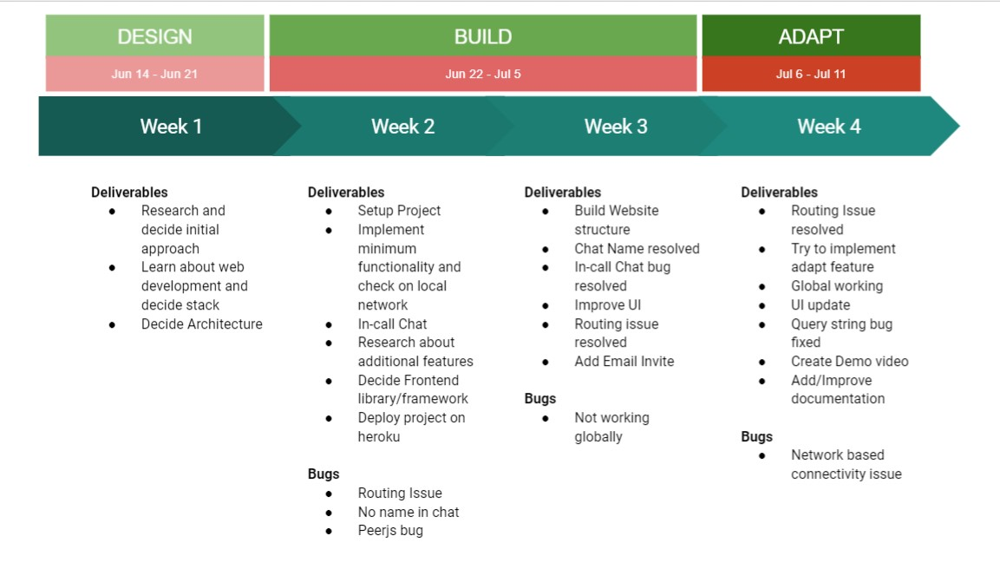

<!--
    README template inspired from https://github.com/othneildrew/Best-README-Template/blob/master/README.md
-->


<!-- PROJECT SHIELDS -->
<!--
*** I'm using markdown "reference style" links for readability.
*** Reference links are enclosed in brackets [ ] instead of parentheses ( ).
*** See the bottom of this document for the declaration of the reference variables
*** for contributors-url, forks-url, etc. This is an optional, concise syntax you may use.
*** https://www.markdownguide.org/basic-syntax/#reference-style-links
-->
<!-- PROJECT LOGO -->
<br />
<p align="center">
    
    <h3 align="center">Microsoft Engage 2021 Challenge</h3>

  <p align="center">
    <br />
    <!-- Youtube Video link -->
    <a href="https://github.com/othneildrew/Best-README-Template">View Demo</a>
    ·
    <a href="https://gentle-woodland-21663.herokuapp.com/">Live Site</a>
  </p>
</p>


<!-- TABLE OF CONTENTS -->
<details open="open">
  <summary>Table of Contents</summary>
  <ol>
    <li>
      <a href="#about-the-project">About The Project</a>
      <ul>
        <li><a href="#development-methodology">Development Methodology</a></li>
      </ul>
      <ul>
        <li><a href="#built-with">Built With</a></li>
      </ul>
    </li>
    <li>
      <a href="#getting-started">Getting Started</a>
      <ul>
        <li><a href="#prerequisites">Prerequisites</a></li>
        <li><a href="#installation">Installation</a></li>
        <li><a href="#running-on-local-network">Running</a></li>
      </ul>
    </li>
    <li><a href="#usage">Usage</a></li>
    <li><a href="#scope">Roadmap</a></li>
    <li><a href="#contact">Contact</a></li>
    <li><a href="#acknowledgements">Acknowledgements</a></li>
  </ol>
</details>


<!-- ABOUT THE PROJECT -->
## **About The Project** 

Microsoft Engage 2021 is a program created by Microsoft engineers, in association with Ace Hacker, for students to work on projects with live interaction and help from engineers and mentors at Microsoft. The challenge was to **build a teams clone** with the mandatory functionality - *a minimum of two participants should be able connect with each other to have a video conversation.* [Microsoft Engage 2021](https://microsoft.acehacker.com/engage2021/?mc_cid=51cf8705a5&mc_eid=e7a7568555#challenge)

### **Development Methodology**
### Scrum methodology
Scrum is an agile development methodology used in the development of software based on an iterative and incremental processes. Each iteration consists of two- to four-week sprints, where each sprint’s goal is to build the most important features first and come out with a potentially deliverable product. 

### Sprint Map

Below image provides insight to sprint wise deliverables and bugs




### **Built With**

* [Bootstrap](https://getbootstrap.com)
* [JQuery](https://jquery.com)
* [Express](https://expressjs.com/)
* [Socketio](https://socket.io/)
* [Peerjs](https://peerjs.com/)

<!-- GETTING STARTED -->
## **Getting Started**

### Prerequisites

Kall uses npm as package manager and is required to install necessary libraries and packages. Node is used for backend development. Therefore node and npm are required which can be downloaded from [here](https://nodejs.org/en/download/)

### Installation

1. Clone the repo
   ```sh
   git clone https://github.com/ApEdu/Video-Call-App.git
   ```
2. Install NPM packages
   ```sh
   npm install
   ```
3. All necessary files and modules are setup now !

### Running on local network

1. You need to run a peerserver to connect peers in terminal
    ```sh
    peer --port 443 --path /peerjs
    ```
2. In separate terminal run the node server
    ```sh
    npm run start
    ``` 
3. Go to your localhost


<!-- USAGE EXAMPLES -->
## **Usage**

In Progress


<!-- ROADMAP -->
## Scope

### Features
- Connectivity for 4-5 participants
- Email invite functionality to bypass url copy pasting practise
- In-call text chat to allow textual interchange

### Possible Improvements
- Kall uses P2P mesh architecture for video calling, an SFU/MCU implementation can be worked upon which will reduce connection load
- Kall uses public cloud PeerServer which does not provide very well cross network connectivity, deploying a custom turn server and peerserver can improve network connectivity issues

<!-- CONTACT -->
## Contact

Gmail : gargapoorv12@gmail.com
LinkedIn : www.linkedin.com/in/apoorv-garg-24q34
Project Link : [https://github.com/ApEdu/Video-Call-App](https://github.com/ApEdu/Video-Call-App)


<!-- ACKNOWLEDGEMENTS -->
## Acknowledgements
 In Progress